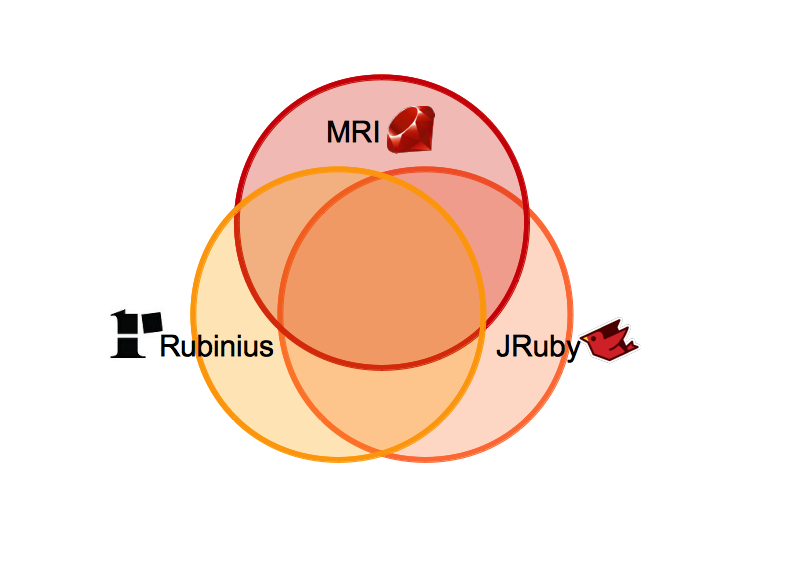
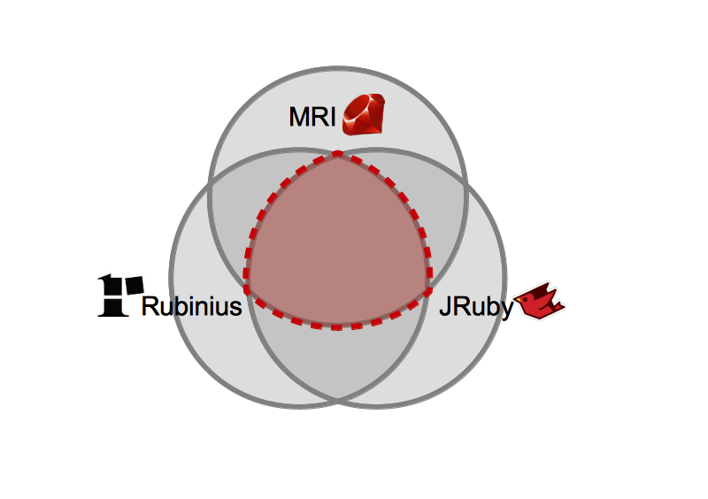
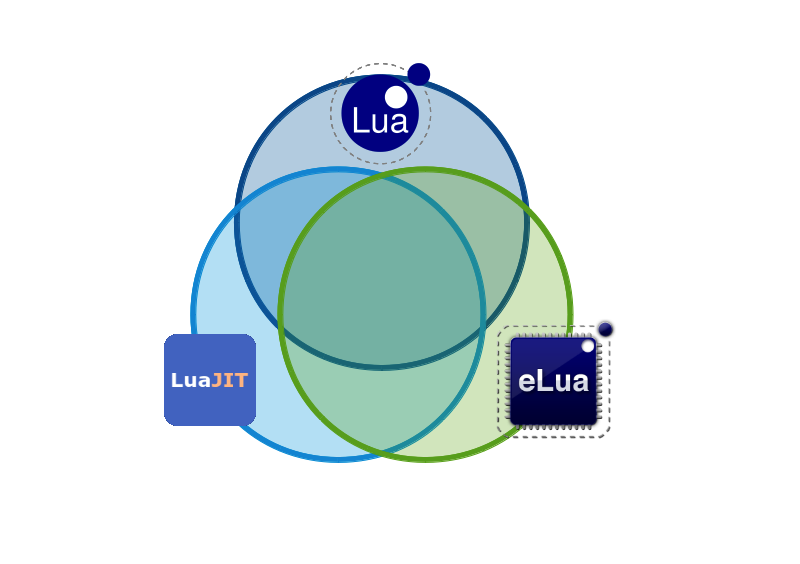
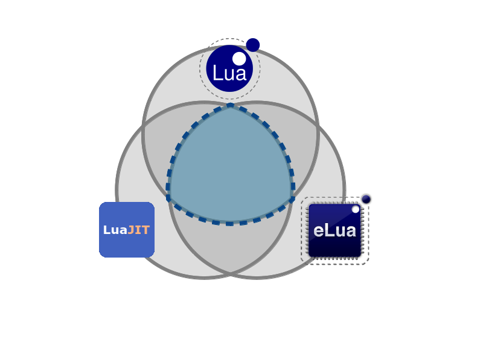

# Lua for Rubyists

## Enrique García Cota

madrid-rb, 2014-01

---

# 2 main parts:

## Lua
## Applications

---

# Lua
## Compared with Ruby

---

# It's Lua, not LUA

---

# SOL &rArr;
## Simple Object Language

---


---

# Lua &rArr;
## “Moon” in Portuguese
## (No Initials)

---


---


---

# Origins

---


| **Ruby**                           | **Lua**                         |
|------------------------------------|---------------------------------|
| Yukihiro, Japan                    | Roberto, Brazil                 |
| PENDING: Image of matz             | PENDING: Image of Roberto(joke) |
| Make programmers happy             | Portable > Embeddable > Fast    |

---

| **Ruby**                           | **Lua**                         |
|------------------------------------|---------------------------------|
| Yukihiro, Japan                    | Roberto, Brazil                 |
| PENDING: Image of matz             | PENDING: Image of Roberto       |
| Make programmers happy             | Portable > Embeddable > Fast    |

---

# Versions

---

# Ruby

## MRI (1.8.7, 1.9.x, 2.x)
## JRuby
## Rubinius

---



---



---

# Lua

## Lua (5.0, 5.1, 5.2)
## LuaJIT
## eLua

---



---



---

# Size

---

# Ruby (MRI)

```bash
git clone https://github.com/ruby/ruby.git
rm -rf ruby/benchmark ruby/bootstraptest ruby/doc \
       ruby/ext ruby/sample ruby/test ruby/tool
cloc ruby
```

## &rArr; ~650k (C, C++, Ruby)

---

# Lua (5.2.3)

```bash
git clone https://github.com/LuaDist/lua.git
cloc lua/src
```

## &rArr; ~15k (C99)

---

# Batteries included

---

# PENDING: Rabbit with/without batteries

---

Artillery battery: PENDING definition

---


---

Pending: Image of soldier

---

# Ruby: Core + stdlib

---
## Ruby core:
```ruby
$ irb
> Object.constants.map{|c| Object.const_get(c)}
 => [ ... ]

> _.select{|c| c.is_a? Class}
 => [ Object, Module, Class, BasicObject, Method,
      NilClass, String, Symbol, Regexp, Range,
      Time, Date, File, Dir, TrueClass, FalseClass,
      Numeric, Integer, Fixnum, Float, Bignum,
      Rational, Complex, Thread, Fiber, ...
    ] (73)

> _.map{|c| c.methods.count}.inject(:+)
  => 7112

> _.map{|c| c.public_methods(false).count}.inject(:+)
  => 399
```

---

## Ruby Stdlib:

* http://www.ruby-doc.org/stdlib-2.1.0

* 109 packages:

  |          |            |            |           |
  |----------|------------|------------|-----------|
  | `set`    | `yaml`     | `minitest` | `erb`     |
  | `base64` | `csv`      | `rss`      | `webrick` |
  | `date`   | `json`     | `zlib`     | `net/*`   |
  | ...      |            |            |           |

* Presentation: “Ruby: Batteries Included”

  http://www.confreaks.com/videos/2347

---

## Lua:

Types (~7)

    string, number, table, boolean, function, thread, nil

Libraries (~7)

    string, math, table, os, io, coroutine, debug

Top-level functions (~30)

    assert          load        pcall     setmetatable
    collectgarbage  loadfile    print     tonumber
    dofile          loadstring  rawequal  tostring
    error           module      rawget    type
    gcinfo          newproxy    rawset    xpcall
    getfenv         next        unpack
    getmetatable    require     select
    ipairs          pairs       setfenv

---
```lua
local name = "peter" -- or 'peter'

other_name = "john" -- global variable!

local age = 17
age = age + 1
local adult = age >= 18 -- boolean

local tname = type(name)
print(tname) -- string

```

---

```lua
local ADULT_AGE = 18
local function is_adult(age)
  return age >= ADULT_AGE
end

-- equivalent*
local is_adult = function(age)
  return age >= ADULT_AGE
end

local adult = is_adult(age)
print(type(is_adult)) -- function
```

---

```lua
local vowels = { 'a', 'e', 'i', 'o', 'u'}
print(vowels[1]) -- a

local person = {}
person['name'] = 'john'
person.age = 17
print(person.name) -- john
print(person.age) -- 17

local another_person = {name = 'john', age = 15}

print(type(vowels)) -- table
print(type(person)) -- table
```

---

# Libraries

---

# Ruby: Gems
# www.rubygems.org

---

# Rails

PENDING: Destroyer

---

# Lua: Rocks
# www.luarocks.com

---


