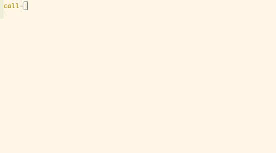
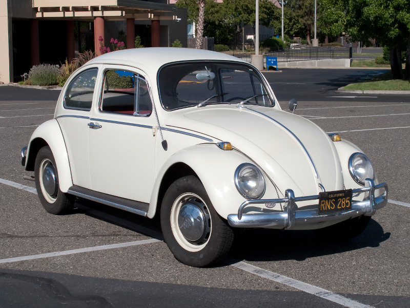

# Lua for Rubyists

### Enrique García Cota (@otikik)

### madrid-rb, 2014-01

---
# 2 main parts:

## Applications
## Comparison

---

# It's Lua, not LUA

---

# SOL &rArr;
## Simple Object Language

---


---

# Lua &rArr;
## “Moon” in Portuguese
## (No Initials)

---
= data-transition='fade'


---
= data-transition='fade'


---

# Part 1: Applications

---


---


---


---


---


---


---


---

> Key-value data store

---

```ruby
require "redis"
redis = Redis.new('localhost', 6379)

redis.set("name", "peter")
name = redis.get("name") # "peter"

redis.set("age", "25")
new_age = redis.incr("age") # 26
```
---

> Concurrent, but single threaded

---


---

```ruby

counter = redis.get('counter')

redis.incr('counter') if counter.is_a? Numeric

```

---

```ruby

script = <<-EOS
  local counter = redis.call("GET", KEYS[1])
  if type(tonumber(counter)) == "number" then
    return redis.call("INCR", KEYS[1])
  end
EOS

redis.eval(script, ["counter"])

```

---


---


---

```bash
brew install vim --with-lua
```

-or-

```bash
brew install macvim --with-lua
```

---



---


---
```bash
                    Startup     Speed

      Vim script    0           1.498s
      Python        0.0166s     0.027s (2000%)
      Lua(jit)      0.0002s     0.001s (1152000%)
```
---
= data-text='centered'

## Corona SDK


---


---


---


---


---

# Part 2: Comparison

---

# Generalities

---


## Yukihiro Matsumoto
> A general-purpose language to make programmers happy

---


---


---


## Roberto Ierusalimschy
> Portable, powerful, embeddable, fast.

---


---


---

# Implementations

---

## Ruby

### MRI (1.8.7, 1.9.x, 2.x)
### JRuby
### Rubinius

---
= data-transition='fade'


---
= data-transition='fade'


---

## Lua

### Lua (5.0, 5.1, 5.2)
### LuaJIT
### eLua

---
= data-transition='fade'


---
= data-transition='fade'


---

# Feel

---
```ruby
# ruby
name   = 'Peter'
age    = 35
genter = :male

puts "#{name} is a #{age} years old #{gender}"
```

```bash
doc = %{
  Lorem ipsum dolor sit amet
}
```
---
```lua
-- lua
local name   = 'Peter'
local age    = 35
local genter = "male"

print(name .. " is a " .. age .. ' years old ' .. gender)
```

```bash
local doc = [[
  Lorem ipsum dolor sit amet
]]
```
---
Ruby comments:

```ruby
# a single-line comment in ruby

=begin
  a multi-line comment in ruby
=end
```

Lua comments:

```lua
-- a single-line comment in Lua

--[[
  a multi-line comment in Lua
]]
```
---

```ruby
#ruby
h = {a: 1, b: 2}
puts h[:b] # 2
puts a.class.name # 'Hash'

a = [1,2,3,4]
puts a[1] # 1
puts a.class.name # 'Array'
```

---
```lua
-- lua
local h = {a = 1, b = 2}
print(h['b'])  -- 2
print(h.b)     -- also 2
print(type(b)) -- 'table'

local a = {1,2,3,4}
print(a[1]) -- 1
print(type(a)) -- 'table'
```
---
## Lua tables:

* Arrays
* Hashes
* Structs
* References
* Environments
* Objects
* ...

---
```ruby
#ruby


def sum(a,b)
  a + b
end


```
---

```ruby
#ruby

module Kernel

  private # ??
  def sum(a,b)
    a + b
  end
end

```

---

```lua
-- lua

function sum(a+b)
  return a + b
end

print(type(sum))   -- 'function'
print(type(type))  -- 'function'
print(type(print)) -- 'function'
```

---

```lua
-- lua

_G.sum = function(a+b)
  return a + b
end

print(type(_G)) -- 'table'
```

---

```lua
-- lua

local sum = function(a+b)
  return a + b
end
```

---

## Lua functions:

* Values
* Blocks
* Scopes
* Iterators
* Generators
* ...

---

## Ruby feels &#9825; &#9825; &#9825;

```ruby

even_numbers = (1..10).select(&:even?)

tweets.delete_if{ |t| t.older_than? 1.week }

```

---
## Lua feels like super-javascript

```javascript

// Very little of this stuff:
[9,10,1,2].sort()
> [1,10,2,9]

```

http://tylerneylon.com/a/learn-lua/

---

# Size

---

## Lines of code

```bash
git clone https://github.com/ruby/ruby.git
rm -rf ruby/benchmark ruby/bootstraptest ruby/doc \
       ruby/ext ruby/sample ruby/test ruby/tool
cloc ruby
```

### &rArr; ~650k (C, C++, Ruby)

```bash
git clone https://github.com/LuaDist/lua.git
cloc lua/src
```

### &rArr; ~15k (C99)

---

## Ruby core:
```ruby
$ irb
> a = Object.constants.map{|c| Object.const_get(c)}
 => [ ... ]

> b = a.select{|c| c.is_a? Class}
 => [ Object, Module, Class, BasicObject, Method,
      NilClass, String, Symbol, Regexp, Range,
      Time, Date, File, Dir, TrueClass, FalseClass,
      Numeric, Integer, Fixnum, Float, Bignum,
      Rational, Complex, Thread, Fiber, ...
    ] (73)

> b.map{|c| c.methods.count}.inject(:+)
  => 7112

> b.map{|c| c.public_methods(false).count}.inject(:+)
  => 399
```

---

## Ruby Stdlib:

### www.ruby-doc.org/stdlib-2.1.0

```ruby

     set         yaml       minitest     erb
     base64      csv        mutex        webrick
     date        json       zlib         net/*
     fileutils   matrix     curses       socket
     pp          profile    rss          uri
                        ...

                       (~109)
```

* Presentation: “Ruby: Batteries Included”:

  http://www.confreaks.com/videos/2347

---


## Ruby &rArr; gems
## rubygems.org
## ~70000 gems

---

## Lua:

Types (~7)

```bash
string, number, table, boolean, function, thread, nil
```

Libraries (~7)

```lua
string, math, table, os, io, coroutine, debug
```

Top-level functions (~30)

```lua
    assert          load        pcall     setmetatable
    collectgarbage  loadfile    print     tonumber
    dofile          loadstring  rawequal  tostring
    error           module      rawget    type
    gcinfo          newproxy    rawset    xpcall
    getfenv         next        unpack
    getmetatable    require     select
    ipairs          pairs       setfenv
```

---


## Lua &rArr; rocks
## luarocks.org
## ~700 rocks

---

# Batteries included

---


---

> **Artillery battery**: a unit of guns, mortars, rockets or missiles so grouped in order to facilitate better battlefield communication and command and control

---


---


---


---


---



---

# Conclusion

---

# Ruby is great.
# Lua is great.

---


---

# Questions?
### Enrique García Cota (@otikik)
### madrid-rb

---

# Thank you! <span class="applause">&#9734;</span>


